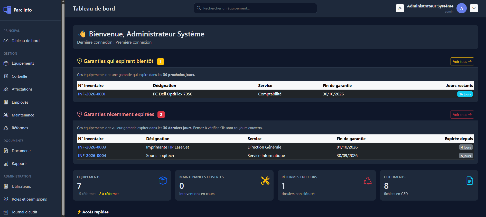

<div align="center">

# 🖥️ Parc Info

### Gestion de Parc Informatique

*Inventaire complet des équipements, gestion des statuts en temps réel, exports PDF/Excel, QR codes, alertes garantie et bien plus.*

[](https://www.php.net/)
[](https://www.mysql.com/)
[](LICENSE)
[](CHANGELOG.md)

[Fonctionnalités](#-fonctionnalités) • [Installation](#-installation) • [Structure](#-structure-du-projet) • [Roadmap](#-roadmap) • [Contribution](#-contribution)

</div>

---

Application web de gestion de parc informatique développée en **PHP pur** (sans framework), suivant une architecture **MVC** propre avec Repository Pattern.

---

## 📖 Sommaire

- [📸 Aperçu](#-aperçu)
- [✨ Fonctionnalités](#-fonctionnalités)
- [🛠️ Stack Technique](#️-stack-technique)
- [📁 Structure du Projet](#-structure-du-projet)
- [🚀 Installation](#-installation)
- [📊 Modèle de données](#-modèle-de-données)
- [🧪 Scripts utilitaires](#-scripts-utilitaires)
- [🐛 Dépannage](#-dépannage)
- [🔄 Roadmap](#-roadmap)
- [🤝 Contribution](#-contribution)
- [📝 Licence](#-licence)
- [👤 Auteur](#-auteur)

---

## 📸 Aperçu

<div align="center">



*Le tableau de bord avec alertes garanties et statistiques en temps réel.*

</div>

---

## ✨ Fonctionnalités

### 📦 Module Équipements (Inventaire)

- [x] CRUD complet (Créer, Lire, Modifier, Supprimer)
- [x] Liste paginée avec tri multi-colonnes
- [x] Filtres simples + avancés (dates, valeurs, garantie)
- [x] Changement de statut en **AJAX** sans rechargement
- [x] **Barre de compteurs** par statut (badges colorés cliquables)
- [x] **Recherche globale** dans la navbar (dropdown AJAX)
- [x] **Corbeille** avec restauration et suppression définitive
- [x] **Duplication** d'équipement en un clic
- [x] **QR Code** unique par équipement (étiquette imprimable)
- [x] **Fiche PDF individuelle** (A4 portrait, avec QR code)
- [x] **Export Excel/CSV** de la liste filtrée
- [x] **Export PDF** de la liste complète
- [x] **Import CSV** avec prévisualisation
- [x] **Pièces jointes** (upload/download)
- [x] **Actions groupées** (bulk update, bulk delete, bulk export)
- [x] **Historique** des modifications (audit)

### 👥 Module Utilisateurs

- [x] CRUD complet
- [x] Rôles et permissions (RBAC)
- [x] Reset password
- [x] Toggle actif/inactif
- [x] Profil personnel
- [x] Sécurité (2FA setup, backup codes)

### 🎭 Module Rôles & Permissions

- [x] CRUD complet
- [x] Attribution de permissions
- [x] Rôle système "admin" (non supprimable)

### 📋 Journal d'audit

- [x] Liste des actions avec filtres
- [x] Traçabilité complète (user, action, entity, IP, user-agent)
- [x] Détails avant/après

### 💾 Sauvegardes BDD

- [x] Création manuelle (mysqldump)
- [x] Liste, téléchargement, suppression
- [x] Rétention automatique (7j / 4sem / 12mois)

### 🖥️ Santé système

- [x] Version PHP, extensions, espace disque
- [x] Permissions dossiers
- [x] Mode maintenance (activable)

### 🤝 Module Affectations

- [x] CRUD complet
- [x] Autocomplete équipement (API AJAX)
- [x] Retour d'affectation → équipement remis "En stock"
- [x] Workflow complet

### 👤 Module Employés

- [x] CRUD complet
- [x] Filtres (recherche, service, statut)
- [x] Utilisé par les Affectations

### 🔧 Module Maintenance

- [x] CRUD complet
- [x] Workflow équipement automatique
- [x] Clôture d'intervention

---

## 🛠️ Stack Technique

| Technologie | Usage |
|:-----------:|:------|
| **PHP 8.2+** | Langage principal (architecture MVC maison) |
| **MySQL 8.4** | Base de données relationnelle |
| **PDO** | Accès BDD sécurisé (requêtes préparées) |
| **Composer** | Gestionnaire de dépendances PHP |
| **Bootstrap 5.3** | Framework CSS responsive (via CDN) |
| **Bootstrap Icons** | Icônes vectorielles |
| **JavaScript (Vanilla)** | Interactions AJAX |
| **Dompdf** | Génération de PDF |
| **PhpSpreadsheet** | Génération de fichiers Excel |
| **Endroid QR Code** | Génération des QR codes |
| **Monolog** | Logging applicatif |
| **Google2FA** | Authentification 2FA |

**Architecture :**

- 🏛️ Pattern **MVC** (Model-View-Controller)
- 📦 **Repository Pattern** (interfaces + implémentations MySQL)
- ⚙️ **Service Layer** pour la logique métier
- 🛡️ **Middleware** (Auth, CSRF, Guest, Permission, RateLimit)
- 🎯 **DTO** et **Enums** pour la robustesse des données

---

## 📁 Structure du Projet

```text
Parc-Informatique/
│
├── app/                              # Code applicatif (PSR-4)
│   ├── Controllers/                  # Contrôleurs
│   ├── Core/                         # Mini-framework (Router, Database, Csrf...)
│   ├── DTO/                          # Data Transfer Objects
│   ├── Enums/                        # Énumérations PHP
│   ├── Exceptions/                   # Exceptions personnalisées
│   ├── Helpers/functions.php         # url(), e(), csrf_field(), flash()...
│   ├── Middleware/                   # Filtres de requêtes
│   ├── Models/                       # Modèles métier
│   ├── Repositories/                 # Contracts + MySql
│   ├── Services/                     # Logique métier
│   └── Validators/                   # Validateurs
│
├── config/                           # app.php, database.php
├── database/                         # schema.sql, seed.sql, fix_encoding.sql
├── public/                           # Document root (accessible web)
│   ├── assets/css|js|images
│   ├── .htaccess
│   └── index.php                     # Point d'entrée unique
├── resources/views/                  # Vues PHP
├── routes/                           # web.php, api.php
├── scripts/                          # Scripts CLI
├── storage/                          # logs, backups, exports, qrcodes
├── tests/                            # PHPUnit
├── .env                              # Variables d'environnement (ignoré Git)
├── .env.example                      # Modèle
├── composer.json
├── CHANGELOG.md
├── LICENSE
└── README.md
```

---

## 🚀 Installation

### Prérequis

| Outil | Version minimale |
|-------|------------------|
| **PHP** | 8.2+ |
| **MySQL** | 8.0+ (ou MariaDB 11+) |
| **Composer** | 2.x |
| **WampServer** | 3.4+ (recommandé sur Windows) |

### Étape 1 : Cloner le dépôt

```bash
git clone https://github.com/corro74-hue/parc-informatique.git
cd parc-informatique
```

### Étape 2 : Installer les dépendances

```bash
composer install
```

### Étape 3 : Configurer l'environnement

Copiez `.env.example` en `.env` :

```bash
copy .env.example .env
```

Ouvrez `.env` et adaptez :

```env
APP_NAME="Gestion Parc Informatique"
APP_ENV=local
APP_DEBUG=true
APP_URL=http://localhost/Parc-Informatique/public
APP_TIMEZONE=Africa/Algiers
APP_LOCALE=fr

DB_CONNECTION=mysql
DB_HOST=127.0.0.1
DB_PORT=3306
DB_DATABASE=parc_informatique
DB_USERNAME=root
DB_PASSWORD=
DB_CHARSET=utf8mb4
DB_COLLATION=utf8mb4_unicode_ci

SESSION_NAME=PARC_SESSION
SESSION_LIFETIME=1800
```

### Étape 4 : Créer la base de données

1. Ouvrez **phpMyAdmin** : `http://localhost/phpmyadmin5.2.3/`
2. Créez une base **`parc_informatique`** (interclassement `utf8mb4_unicode_ci`)
3. Importez `database/schema.sql` (onglet **Importer**)
4. Importez `database/seed.sql` (données initiales)

### Étape 5 : Placer le projet dans WampServer

Le projet doit être dans :

```text
C:\wamp64\www\Parc-Informatique\
```

⚠️ Respectez la casse : **P** et **I** majuscules

### Étape 6 : Lancer l'application

Ouvrez dans votre navigateur :

```text
http://localhost/Parc-Informatique/public/
```

### Étape 7 : Se connecter

| Champ | Valeur par défaut |
|-------|-------------------|
| **Utilisateur** | `admin` |
| **Mot de passe** | `admin` |

⚠️ **Changez ce mot de passe après la première connexion** (via Profil → Sécurité)

---

## 📊 Modèle de données

Le projet utilise **39 tables MySQL**, dont :

| Table | Description |
|-------|-------------|
| `equipment` | Équipements du parc |
| `equipment_categories` | Catégories (PC, imprimante...) |
| `equipment_statuses` | Statuts (En service, En panne...) |
| `brands` | Marques (HP, Dell...) |
| `services` | Services de l'entreprise |
| `sites` | Sites physiques |
| `locations` | Localisations précises |
| `employees` | Employés |
| `assignments` | Affectations d'équipements |
| `maintenance` | Historique de maintenance |
| `reformations` | Équipements réformés |
| `inventory_campaigns` | Campagnes d'inventaire |
| `audit_logs` | Journal d'audit |
| `users` | Utilisateurs |
| `roles` / `permissions` | RBAC |

---

## 🧪 Scripts utilitaires

```bash
# Tester la connexion à la base
php scripts/test_charset.php

# Tester le module équipement
php scripts/test_equipment.php

# Réinitialiser l'admin
php scripts/reset_admin.php
```

---

## 🐛 Dépannage

<details>
<summary><strong>🔴 L'icône WampServer reste orange</strong></summary>

**Cause :** Conflit de port 80 avec un autre programme (Skype, IIS, etc.)

**Solution :** Vérifiez qu'aucun autre programme n'utilise le port 80.

</details>

<details>
<summary><strong>🔴 Erreur 404 sur toutes les pages</strong></summary>

**Cause :** `BASE_PATH` dans `public/index.php` ne correspond pas au nom réel du dossier.

**Solution :** Vérifiez que le dossier s'appelle exactement `Parc-Informatique` (casse incluse).

</details>

<details>
<summary><strong>🔴 Les accents s'affichent mal</strong></summary>

**Cause :** Problème d'encodage UTF-8.

**Solution :** Vérifiez que la BDD et les tables sont en `utf8mb4_unicode_ci`, et que `charset=utf8mb4` est dans le DSN PDO.

</details>

<details>
<summary><strong>🔴 Composer introuvable</strong></summary>

**Cause :** Composer n'est pas dans le PATH Windows.

**Solution :** Vérifiez que `C:\ProgramData\ComposerSetup\bin` est dans le PATH.

</details>

---

## 🔄 Roadmap

### ✅ Terminé (v0.5.0)

- [x] Authentification + 2FA
- [x] Module Équipements complet
- [x] Module Utilisateurs & Rôles
- [x] Module Affectations
- [x] Module Employés
- [x] Module Maintenance
- [x] Module Sauvegardes BDD
- [x] Journal d'audit
- [x] Santé système

### 🚧 En développement (v0.6.0)

- [ ] Module Campagnes d'inventaire
- [ ] Module Rapports (statistiques + graphiques Chart.js)
- [ ] Module Documents (GED)
- [ ] Module Paramètres (SMTP, notifications, sécurité)

### 🔮 Prévu (v1.0.0)

- [ ] API REST complète
- [ ] Mode sombre
- [ ] Notifications temps réel
- [ ] Application mobile
- [ ] Tests automatisés (PHPUnit)

---

## 🤝 Contribution

Les contributions sont **les bienvenues** ! Pour contribuer :

1. **Fork** le projet
2. Créez une **branche** : `git checkout -b feature/nouvelle-fonctionnalite`
3. **Commit** : `git commit -m 'Ajout de la fonctionnalité X'`
4. **Push** : `git push origin feature/nouvelle-fonctionnalite`
5. Ouvrez une **Pull Request**

---

## 📝 Licence

Ce projet est sous licence **MIT**. Voir le fichier [LICENSE](LICENSE) pour plus de détails.

---

## 👤 Auteur

<div align="center">

**corro74-hue**

[](https://github.com/corro74-hue)

</div>

---

## 🙏 Remerciements

Merci aux projets open-source qui rendent ce projet possible :

- [Bootstrap](https://getbootstrap.com/) — Framework CSS
- [Bootstrap Icons](https://icons.getbootstrap.com/) — Icônes
- [Dompdf](https://github.com/dompdf/dompdf) — Génération PDF
- [PhpSpreadsheet](https://github.com/PHPOffice/PhpSpreadsheet) — Fichiers Excel
- [Endroid QR Code](https://github.com/endroid/qr-code) — QR Codes
- [Monolog](https://github.com/Seldaek/monolog) — Logging
- La **communauté PHP** pour l'inspiration

---

---

## 📜 Épopée du projet

> *Un jour, un développeur, un WampServer orange, et une histoire de casse dans `Request.php`...*

Découvrez la [**légende de Wamp64**](EPOPEE.md) — le poème qui raconte la naissance de ce projet.

---

<div align="center">

### ⭐ Si ce projet vous a aidé, n'hésitez pas à lui donner une étoile !

**Fait avec ❤️ en PHP**

[⬆ Retour en haut](#️-parc-info)

</div>